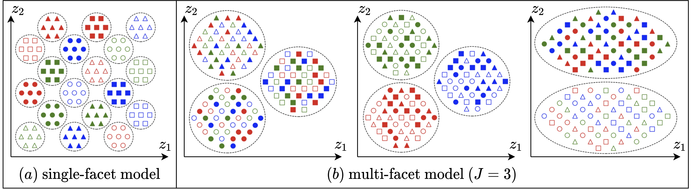
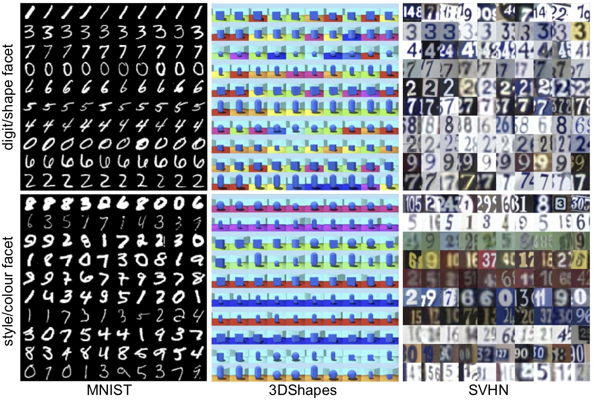
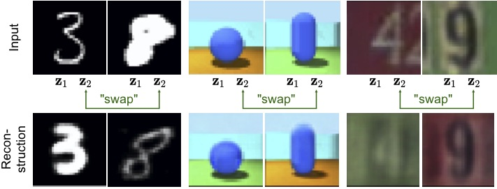
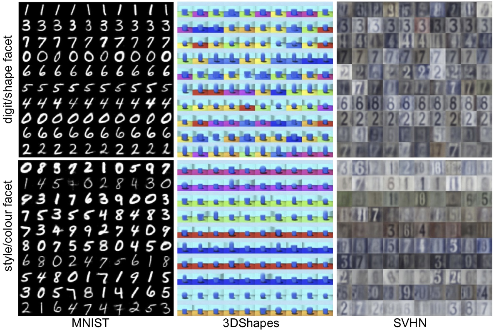

# Multi-Facet Clustering Variational Autoencoders



This repository is the official implementation of **[Multi-Facet Clustering Variational Autoencoders (MFCVAE)](TODO)**. 

MFCVAE is a principled, probabilistic clustering model which finds multiple partitions of the data
simultaneously through its multiple Mixtures-of-Gaussians (MoG) prior.
Our model lies in the framework of variational autoencoders, and is 
trained fully unsupervised. 

MFCVAE discovers a disentangled multi-facet structure in an exploratory setting,
allows to compose representations of inputs in the latent space, 
perform generative classification, and generate diverse, synthetic samples.  

The MFCVAE model is implemented with the *PyTorch Distributions* package, 
the training script and other network related operations are using PyTorch. 

[Click here for the paper](TODO).

## Setup

### Anaconda environment

Let us first set up a new anaconda environment `mfcvae` as 

```
conda create -n mfcvae
```

Next, we activate `mfcvae`: 

```
conda activate mfcvae
```

Note that throughout this README, we will assume that the environment `mfcvae` is activated.
We now install pip in it.

```
conda install pip
```

Next, we install all dependencies of our code from the `requirements.txt` as  

```
pip install -r requirements.txt 
```

*(Optional):* As an alternative way to install your conda environment, 
we also provide our `environment.yml`. 
We note that this sometimes causes
dependency problems, especially when used in operating systems other than Linux. 
You can use it to create your conda environment in a single step as

```setup
conda env create -f environment.yml
```
  
and activate it afterwards as

```
conda activate mfcvae
```

### Datasets

This implementation allows training and evaluating MFCVAE on three datasets: [MNIST](http://yann.lecun.com/exdb/mnist/), [3DShapes](https://github.com/deepmind/3d-shapes), and [SVHN](https://github.com/deepmind/3d-shapes).
MNIST and SVHN will be automatically downloaded into the folder `data/` when running `train.py` for the first time.
For 3DShapes, download the file `3dshapes.h5` from [this link](https://console.cloud.google.com/storage/browser/3d-shapes;tab=objects?prefix=&forceOnObjectsSortingFiltering=false) 
(see [the 3DShapes repository](https://github.com/deepmind/3d-shapes) for further instructions) 
and put this file into a directory `data/Fast_3DShapes/raw`.

### Weights&Biases

To visualise and log our experimental results, we use weights&biases (referred to as `wandb`) as a dependency.
`wandb` is a logger (just like Tensorboard) which stores all content of a run (hyperparameter configs, experimental results, gradients, losses, ...) on a server that can be accessed via a website.

To use `wandb`, one needs to set up an account here: https://wandb.ai/home . 
Further, one has to create a team with a `team_name` (for academics, creating a team is free, see this link: https://wandb.ai/site/academic) 
and within that team a project with a `project_name`. 
Your account also comes with a login/API key, which you can find under your account (top-right) when logged in -> 
settings -> API key. It is a hash of >10 characters. We refer to it as `login_key`. 

You can collaborate with others by working on the same `wandb` project, but using 
different API keys. You can use `'user1'` or `'user2'` as values for the command line argument `--user` in `train.py` to choose the API key.

Equipped with these, now change `configs/wandb.yml` as follows:

First, define the login/API key:
```python
login_key_1: <your-api-key>  # referring to API key of 'user1'
```
and/or 
```python
login_key_2: <your-api-key>  # referring to API key of 'user2'
```
depending on the user.

For example:

```python
login_key_1: c83202x.........
``` 

Then define the team name and project name:

```python
team_name: <your-team-name>
project_name: <your-project-name>
```

After setting these, you will now be able to do the following:

(1) Perform single runs by running `train.py`, 
(2) Start or attach sweeps by running `start_sweep.py` or `attach_sweep.py`,
with results logged on weights&biases. 

## Contents

The following table gives an overview on the main contents (files and directories) of this repository: 

| File or Directory      | Description |
| ----------- | ----------- |
| `configs/`      | Contains several `.yaml` files, one per dataset (configuration), specifying the hyperparameters of each reported run in a human-readable form.  |
| `data/`   | Directory where data is downloaded to and stored.        |
| `graphics/`   | Directory for figures in this README.        |
| `new_trained_models/`   | Directory for storing any newly trained models.        |
| `pretrained_models/`   | Directory for storing pretrained models.        |
| `results/`   | Directory for storing results.        |
| `shell_scripts/`   | Directory where all shell scripts for reproducing our main results in the paper are stored.        |
| `shell_scripts/`   | Directory to store (newly) trained models.        |
| `wandb/`   | Weights&Biases directory where individual runs are stored.        |
| `start_sweep.py`, `attach_sweep.py`   | Scripts for starting a sweep (e.g. over random seeds) and attaching further machines to a sweep.        |
| `mfcvae.py`, `conv_vlae.py`, `models_fc.py`   | Files implementing MFCVAE, as well as several sub-modules of its architecture.        |
| `datasets.py`   | Implementing dataset classes. Note that all datasets are implemented so that they are stored right on GPU during training to lower training time. We provide a customised Dataset class for 3DShapes, and for the most part resemble the torchvision Dataset class for MNIST and SVHN.       |
| `environment.yml`   | yaml file for setting up the Anaconda evnironment.         |
| `eval_compositionality.py`, `eval_sample_generation.py`, `eval_top10_cluster_examples.py`   | Scripts to produce the plots in the experiments section of our paper.        |
| `load_model.py`   | Script to load the MFCVAE model from a .pt and args serialized files.        |
| `plot_intuition.py`   | Implementation of Figure 1 in our paper.        |
| `plotting.py`   | Functions for various plots.        |
| `train.py`   | Training script for MFCVAE (main script used for training a model).        |
| `utils.py`   | Miscellaneous functions.         |

We use `wandb` for *logging* the following results and conent (note that many of these are logged for train and test data): 
* Gradients of loss function w.r.t. all parameters of the model (figure)
* Components of the 5-term loss function and overall loss (scalar)
* Sample generation plots, one per facet (figure)
* Input examples assigned to clusters, one per facet (figure)
* Input examples and corresponding reconstructions, one per facet (figure)
* Confusion matrix, one per label (figure)
* pi parameters of p(c_j), bar chart, one per facet (figure)
* Number of input examples assigned per cluster, rug plot, one per facet (figure)
* Unsupervised clustering accuracy, 1) plain, one per facet 2) weighted (by class frequency), one per facet 3) mean and 4) maximum over labels and facets (scalar)
* Number of clusters with at least one input example assigned, one per facet (scalar) 

## Reproducing main results:

To reproduce the main results in this paper, we provide 3 ways with increasing computational requirements:
Reproducing our plots with provided pretrained models, 
rerunning a single run on each dataset, 
and running 10 runs per dataset with different random seeds.  

### Reproduce results using pretrained models

In `pretrained_models/`, 
we provide trained models of a specific run with the hyperparameters detailed
in our paper and provided as `.yaml` files in the repository `configs/`.
To retrieve all plots in our main paper, run the corresponding evaluation shell 
script `eval_<dataset>.sh` in `shell_scripts` for the dataset of your choice: 

```
./eval_<dataset>.sh
```

For example: 

```
./eval_mnist.sh
```

Note that this assumes you have to execute permissions on this file (do e.g. `chmod 777 eval_mnist.sh`
first if you need to set these permissions).

The pretrained models used here can itself be produced using the second way described next.

### Reproduce results by training a model 

To train a model with a certain random seed from scratch using the hyperparameter configurations 
detailed in our paper and provided as `.yaml` files in the repository `configs/`, we provide 
another 4 shell scripts. These are named `run_<dataset>.sh`, and can be run as:  

```
./run_<dataset>.sh
```

For example: 

```
./run_mnist.sh
```

Note that this will start a run, and on the command line output, a link to the run on the 
weights&biases server will be shown. Copy this link and paste it into your browser to see
further logs of this run, including the training and test accuracies of the model during training, 
loss values, and various plots (most of them different to the plots produced by the `eval_...` scripts).

Once training has completed, your model will be saved as a file `save_dict.pt` in the weights&biases directory in the folder `wandb/`.
Alternatively, you can download it from the run page -> Files (left-hand side) -> download `save_dict.pt`.
Then, to get all result figures (input examples, generations, compositionality), store the model in the folder
`new_trained_models/` and adapt the `eval_<dataset>.sh` to the correct path (or use the `eval_<dataset>.py` scripts directly).

### Reproduce results by running a seed sweep 

As we argue in the paper, stability is crucial in deep clustering, and one way to test it 
is by doing a "sweep", i.e. 10 runs, with different random seeds for initialisation.
To do so, use the scripts `sweep_seed_<dataset>.sh` as follows: 

```
./sweep_seed_<dataset>.sh
```

For example: 

```
sweep_seed_mnist.sh
```

On your command line output, in addition to the run link, you will see a sweep link that you can 
open to check the sweep's runs and their logs. If you have multiple machines at hand, you can "attach"
them to this sweep. This means that they will grab the next seed value, and train a model from scratch, 
until all 10 models are trained. To do so, use the `attach_sweep.py` script with the `--config_args_path`
argument corresponding to your dataset. For example, if you started the sweep for MNIST and it has
sweep ID `chvie4r1` (which you can find on the info page on weights&biases), execute: 

```
python3 attach_sweep.py --sweep_id chvie4r1 --config_args_path "configs/mnist.yaml"
```

As before, you can subsequently pick one or all of the runs in this sweep, get the model, 
and post-process the evaluation plots.  

## Training

To train a model, use the `train.py` script. First, go to the repository folder: 

```
cd <path-to-repository>/mfcvae/
```

Then, call the train script as

```
python train.py --<arg1> <value1> ...
```

One can change a long list of configurations, 
e.g. what dataset to train on, which device to use, which value of J to pick, ... .
We refer to the `train.py` script and the `help` descriptions for details on how to 
use these arguments in detail. 

Also, we refer to the scripts `start_sweep.py` and `attach_sweep.py` as used above
to run hyperparameter sweeps.

## Evaluation

To evaluate a trained model, we refer to two ways (see also notes on reproducing results above): 

1) Use the weights&biases interface on the corresponding run link, where we log
    a long list of metrics and plots, including loss (components), accuracies, 
    confusion matrices, reconstruction plots, number of clusters during training in each facet, etc..
2) To produce the plots in our paper, one needs can use the python scripts `eval_....py` or the corresponding `eval_<dataset>.sh`
    shell scripts.

## Pre-trained Models

All pretrained models are provided in the folder `pretrained_models/`.
To evaluate the pretrained models, we refer to the section *Reproduce results using pretrained models* above.

## Results

We briefly illustrate key results from our experiments: 

### Discovering a multi-facet structure



### Compositionality of latent facets



### Generative, unsupervised classification

| | MNIST  | 3DShapes <br /> (configuration 1) |  3DShapes <br /> (configuration 2) |  SVHN |
| ------------------ |---------------- | -------------- | ------------ |  ------ |
| MFCVAE (J=2) | 92.02% &pm; 3.02% | floor colour: 99.46% &pm; 1.10% <br /> object shape: 88.47% &pm; 1.82% | wall colour: 100.00% &pm; 0.00% <br /> object shape: 90.05% &pm; 2.65% |  56.25% &pm; 0.88%  |

### Diversity of generated samples




## Contributing

We welcome extensions of this repository, for example to new datasets and tasks!
Please leave an issue if you have any questions.

## Citation

TODO 


